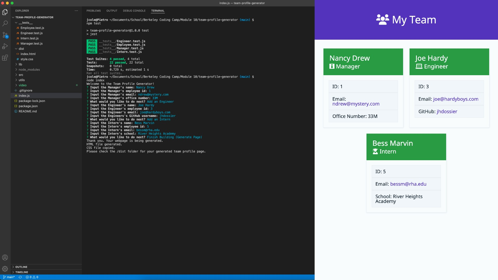

# Team Profile Generator

## Description

This team profile generator works through the command line by asking a series of questions. The information submitted is saved as classes for different roles, which are a subclass of Employee. After the questions are answered, the generator takes the answer classes and applies the information to an HTML file and, along with copying over an accompanying CSS file, outputs it into the /dist folder.

[](https://drive.google.com/file/d/1JVojvVHTP7w2Hpn1TvVMReIvvN6oEtdu/view?usp=sharing)

View video of the working application: [Download Local File](https://github.com/JColeCodes/squad-dynamo/raw/main/video/Team%20Profile%20Generator.mp4) | [Google Drive](https://drive.google.com/file/d/1JVojvVHTP7w2Hpn1TvVMReIvvN6oEtdu/view?usp=sharing)

[View a sample HTML Page](https://jcolecodes.github.io/squad-dynamo/dist/) | [Sample HTML Code](https://github.com/JColeCodes/squad-dynamo/blob/main/dist/index.html)

## Table of Contents

* [Installation](#installation)
* [Usage](#usage)
* [Contributing](#contributing)
* [Tests](#tests)
* [Questions](#questions)

## Installation

To install this project, please follow these steps: 
1. Make sure you have [Node.js](https://nodejs.org) installed.
2. Through the command line, go to the folder you wish this application's folder to be in.
3. Do `git clone` of the repository to get the application's files.

This program requires the following packages from npm: 
* [inquirer](https://www.npmjs.com/package/inquirer)
* [jest](https://www.npmjs.com/package/jest)

In order to install all of them, enter the following into the command line:
```
npm install
```

## Usage

To run this project, enter the following into the command line:
```
node index
```

## Contributing

If you would like to contribute to this project, you can do so by:
1. Forking the project. ([Learn how to fork.](https://docs.github.com/en/get-started/quickstart/fork-a-repo))
2. Creating a new feature branch, committing the changes, and pushing the branch.
3. Opening a [Pull Request](https://github.com/JColeCodes/squad-dynamo/pulls).

You can also check the list of [Issues](https://github.com/JColeCodes/squad-dynamo/issues).

Read the [Contributor Covenant Code of Conduct](https://www.contributor-covenant.org/version/2/1/code_of_conduct/).

## Tests

This application currently has tests set up via Jest for testing. To run it, enter into the command line:
```
npm test
```

## Questions

Team Profile Generator was created by [JColeCodes](https://github.com/JColeCodes). For inquiries regarding the project, please email the creator at [capauldi@gmail.com](mailto:capauldi@gmail.com).